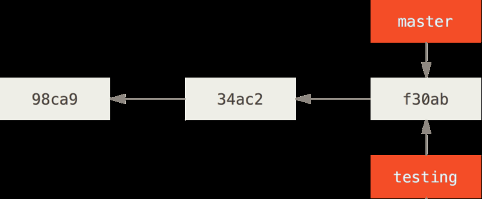
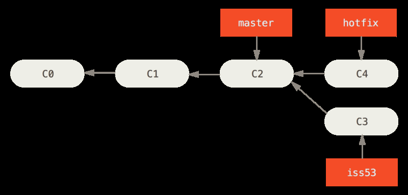
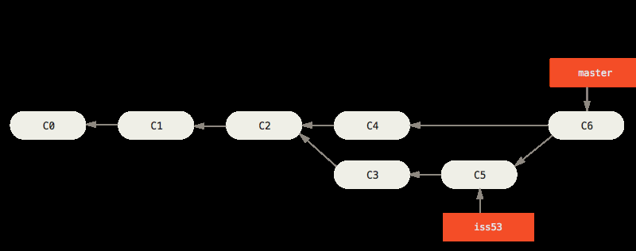

****
# Git - Branches

## Formål
- At blive mere fortrolig med de grundliggende funktioner i GIT: init, clone, add, commit, checkout, fetch, pull, push, merge, log
- At kunne anvende branches i en udviklingsproces: branch, rebase, cherry-pick, labels, forking

## Erhvervskompetencer

- At kunne indgå i et professionelt udviklerteam, som anvender GIT

##  Baggrundsmateriale

- [Gratis e-bog](https://git-scm.com/book/en/v2) om GIT
- [Brug denne interaktive tutorial](http://learngitbranching.js.org/) til at lære om GIT branching i alle ender og kanter.  

## Grundlæggende brug af GIT

For de som trænger til en sammenhængende gennemgang af de grundliggende kommandoer i GIT, har vi samlet en side med [instruktioner og øvelser](gitoverview.md).

## Branching and merging i GIT  

- Litteratur: Git Book (pro git) side 89-95

Vi anbefaler, at de enkelte Scrum-teams anvender følgende GIT-workflow:

Formålet med dagens workshop i GIT er, at få praktisk erfaring med brug af netop Git Feature Branch Workflow. På Atlassians hjemmeside findes en grundig gennemgang: [Git Feature Branch Workflow](https://www.atlassian.com/git/tutorials/comparing-workflows/feature-branch-workflow)

#### Branches checklist (what you should know at the end of the workshop):
1. Create branches  
2. Merge branches
3. [Feature branch workflow](https://www.atlassian.com/git/tutorials/comparing-workflows/feature-branch-workflow)
4. Merge branches with [rebase](https://git-scm.com/book/en/v2/Git-Branching-Rebasing)  
5. [Forking a project vs. branching](https://confluence.atlassian.com/bitbucket/branch-or-fork-your-repository-221450630.html)  
6. Making a pull request
   - Using git issues   
   - Labels and notifications

#### What are branches?
- Branching means you diverge from the main line of development and continue to do work without
  messing with that main line.
- Branch is a pointer to a commit
- All commits (except for the first one) has a reference to its parent.
- When starting a new branch from e.g. master - both master and the new branch are references to the last commmit.
  - the next commit if on <new branch> will be a commit that is not on master (and vice versa)
  - Then if we checkout master and make changes and a new commit (these changes will not be in <new branch>)  

  

#### Why would we need branches? 
- To work independently on a feature without involving the rest of the project.

#### How should i branch
- "Branch early and branch often" // and merge (in the branch and delete it) equally often (when the feature is tested). 
- `git branch <branch name>` //Creates a new branch from HEAD (the pointer to the current commit)
- `git checkout <branch name>` //moves HEAD to the other branch (next commit will now be on this branch. HEAD can only point to one commit at a time (the commit that will be the parent of the next commit)

### Create new branches
- Creating a branch just creates a new pointer to the current commit
  - `git branch <branch name>` creates a new branch by that name.
  - there should now be 2 pointers to the current commit (master and the new branch)
  - `git branch` shows what branches there are
  - the asterisk (*) before the name of one branch tells which one is active.
  - making a new commit will move HEAD of the active branch
  - `git checkout <branch name>` changes current branch
  - `git checkout -b <branch name>` creates and checks out the new branch 

### Push branch to upstream
- when a branch is created and checked out locally - we cannot push to master
- we get this message: `fatal: The current branch development has no upstream branch.`
- So when we push we need to do it like this: `git push --set-upstream origin development` (if origin is our host and development is the branch)

Branches are easy to move around and often refer to different commits as work is completed on them. Branches are easily mutated, often temporary, and always changing.

### Changing branch
**IMPORTANT**: 
- Git resets your working directory to look like it did the last time you committed on that branch.   
- It adds, removes, and modifies files automatically to make sure your working
  copy is what the branch looked like on your last commit to it.  
- When we change branch we just move the HEAD pointer to a new branch (which itselfes is a pointer to a commit)  
- When we want to change branch we will not be allowed to do so if  
  - uncommitted changes in the working area or staged area conflicts with content in the branch we want to change to  
  - Solution is to commit all before we change branch.

### Lets demo
 
**Demonstrate creating branches and commits in each branch**

- `git branch development` // or `git checkout -b development` - creates and checks out in one command.
- `git checkout development`
- `vim somefile.txt` // Add some text in the new file and hit Esc :wq to save and quit
- `git add .` and `git commit -m "added somefile.txt"`
- `git checkout master`
- `vim newfile.txt`
- `git add .` and `git commit -m "added newfile.txt"`
- `git log --oneline --decorate --graph --all`

### Small individual class exercise
1. Create 3 branches
2. Check them out individually and add a file and commit in each branch
3. run: `git log --oneline --decorate --graph --all` to see how your git branches look now
4. create an alias so that you can run the command in this prevous line by just writing `git graf`.

### Small exercise in pairs (master - development branches)
Work in pairs to:

- create a new repo on github
- clone the repo to local repo
- Person1: Create a new branch named: development (there will now be 2: master and development)
- commit some changes to development and push to remote
- Person2: fetch and merge the new branch (do this from a clean index and working area - eg. all is committed)
- Both Person1 and Person2 create new branch containing your name and push it to remote.
- create a new branch each with your name in it.

### Merging and deleting branch
- First checkout the branch you want to keep then. (Maybe you need to pull latest version of the branch from the server first.)
- `git merge <branch name>` merges <branch name> branch into current branch
- Now checked out branch points to the last (merged) commit.
- Delete the branch that was merged in `git branch -d <branch name>`

### Quit merging:
- `git merge --abort` to stop merging in case of a merge conflict

### Fast-Forward merge
- A fast-forward merge is a merge in which the head of the branch you are trying to merge into is a direct descendent of the head of the branch you want to merge (E.g. there has been no unshared commits on the current branch since the new branch started off of it).
- Image below shows how C4 is a direct desendant of C2 and therefore fast-forward merge to master is possible. For details see [Git branching and merging](https://git-scm.com/book/en/v2/Git-Branching-Basic-Branching-and-Merging).

  

### Three way merge
- Different from fast-forward since the commits/branches being merged does not descent of each other
- Instead they share a common commit somewhere back in history
- the 2 commits being merged + the common ancestor are used in a three way merge
- Results in a **new** (merge-)commit that has 2 ancestor commits (each of the branches)
- Will create a conflict if same section(s) in same file(s) has been modified by both branches  

The image shows how iss53 branch is merged into master with three-way-merge using C5+C4 and their common ancestor C2 to create a new merge commmit: C6 which master will then point to (and now iss53 can be deleted)

### Merge conflicts
When you `git merge` and it creates a CONFLICT do `git status` and it tells what to do
- The file(s) that have conflict(s) must be resolved and then `git add <file>`
- `git add` resolves the conflict (the added file will be the version going forward)
  - Even if the file is not changed (still contains <<<<<<<<<<<<<<< and =============== and >>>>>>>>>>>>>>>>) 
- `git commit` will now finalize the merge.
- Resolving merge conflicts often require discussing what changes to keep between all members of your team (or at least the people who wrote both changes that conflicts.

### Lets demo
  
**Merge conflicts**

1. create a new repo
2. make some files - add - commit
3. Create a new branch <mybranch>
4. In each branch master and mybranch change the text file (one: deletes a line and two: change the line)
5. Commit each branch
6. Merge mybranch into master
7. git status
8. Look inside the file and see how to solve the conflict
9. Solve the conflict and commit.

### Small exercise
1. Create a new git repo
2. Add a text file to the repo and run: `git add .` and `git commit -m "initial commit"`
3. checkout a new branch: feature1
4. do some changes to the text file - save - git add <filename> - git commit
5. checkout a new branch: feature2
6. do some changes to the text file - save - git add <filename> - git commit
7. merge the two branches and resolve conflict

### Rebase
- To get a straight commit history
  - As if the work done in the 2 branches were done sequentially (not in parallel)
  - `git rebase <branch name>` means our current branch will have all its unique commits **copied** onto the <branch name> branch
    - the original commits still exist for some time but without a reference to them (no pointer)
  - `git checkout <branch name>` and `git rebase <original branch name>` Now ensures that both branches are updated and pointing to the same commit end point  
  - `git rebase <branch1> <branch2>`
    - add (copies) all commits from <branch2> onto <branch1> and attaches head to <branch2> 
    - if <b2> is an ancestor to <b1> then there is no need to copy any commits to <b1> from <b2> instead <b2> will just point to <b1> and HEAD will be on <b2>
- ONLY rebase local commits (never commits that has been pushed to remote. Because it changes history that others might depend on). A general rule of thumbs when the questions is whether to merge or to rebase: Rebase local changes you’ve made but haven’t shared yet before you push them in order to clean up your story, but never rebase anything you’ve pushed somewhere.

## Advanced GIT commands and practices
These are not necessary for most teams, but nice to know.

### Changing (moving commits) in existing branches
This is advanced stuff, and is best practiced through this [interactive exercise](http://learngitbranching.js.org/)

- HEAD is the currently checked out commit
- Normally Head points to a branch name
- Detaching HEAD
  - Means to checkout a commit (instead of a branch)
  - `checkout <commit hash>` This detaches HEAD from the branch to the specific commit
  - commits made in detached HEAD state are not lost! 
    - Do this: 
      - `git reflog` //Shows all the commits - find the one to recover
      - create a branch at that exact commit: `git branch <branch name> <commit hash>`
      - Then the new branch can be merged with a proper branch.
    - Or this
      - `git cherry-pick <commit hash1> <commit hash2> etc...` //Adds the commits to the end of current branch (and move branch pointer to the last commit)
- Relative refs:
  - One commit up: `^`
  - `Master^` Means the first parent of Master
  - `<branch name>^^` Means 
  - grand parent of that specific branch.
  - `git checkout HEAD^^` means: 'go back twice up through the commit tree'.
  - `git checkout HEAD~4` means: 'go back 4 times from current commit.'
- Moving a branch to another commit:
  - `git branch -f master HEAD~3` means to move the master branch back to the commit 3 commits previous
    - This just means that the pointer: 'Master' now points to that previous commit
    - (To move HEAD just use `git checkout`)
- Reverting changes
  - `git reset <commit hash>/or relative ref`
    - This just moves the current branch to a previous commit - Like rewriting history (the later commits then never really happend).
    - `git reset HEAD~4` Moves the current branch back 4 commits ago.
    - This works well locally on your own computer
    - Does not work on a shared repo/ remote branch - where other people are working on the later commits
  - `git revert <commit hash>`
    - This makes a copy of the specified commit and puts it after the last commit and then attaches the current branch to this new commit. In this way the repos content is reverted to the previous commit without loosing any history.
- Copy a number of commits to the current branch
  - `git cherry-pick <commit hash> <commit hash>` This copies the specified commits to the current branch and moves the head to the last of the commits.
  - The commits that are copied can be from different branches
- Change the commit history
  - Interactive rebase means opening an editor to rearrange and remove commits
  - `git rebase -i HEAD~4` opens up the last 4 commits for rearranging. Either change the order or 'pick' commits which will remove them from the list of commits that then will be copied on to the last commit (before the 4 that were chosen for change) and the current branch will point to the last of the copied commits.
- Cherry-pick example
  - `git checkout master` which is parent to the develop branch
  - `git cherry-pick C2` which is a commit further up the line in the development branch
  - `git commit --amend` changes the current commit (C2)
  - `git cherry-pick C3` the last commit in the development branch
  - So now master is pointing to the development branch (merged) and C2 was changed with some content

### Small exercise manipulating branches
1. create a git repo
2. make 3 commits in master
3. make 2 new branches: development, feature1
4. create 3 commits in both development and feature1 (files need to be created or changed in each commit)
5. Move feature1 to the head of development

### Git issues
- Issues are like user stories in a scrum team or
- Task tracking system with notifications, discussion forum and project planning tool.
- [See more here](https://guides.github.com/features/issues/)

### Git milestones
- Use mile stones to attach to issues (This enables us to set deadlines on our issues and to use issues for sprint planning) 

### Git issues - labels
- Labels are for issues a way to categorize issues (often across multiple repos)
- See example [here](https://robinpowered.com/blog/best-practice-system-for-organizing-and-tagging-github-issues/)

### Small exercise with issues, milestones and labels
1. In the last repo you created
  1. create 3 milestones
  2. Create 2 label: 'new feature' and 'java servlet'
  3. create 3 isssues and tag them with labels and milestones
  4. add Assignees to each issue

### Git forking
- A fork is a copy of someone elses repo. 
- Usually done because you want to use their repo as a starting point for your own project.
- [See more here](https://help.github.com/articles/fork-a-repo/)

### Git pull request
pull requests are a mechanism for a developer to notify team members that they have completed a feature. Once their feature branch is ready, the developer files a pull request
