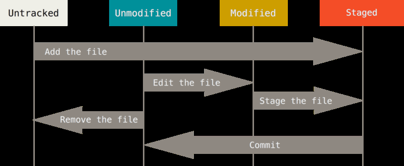

# Git overview
Denne side indeholder en generel introduktion til GIT med de mest anvendte kommandoer og en række tilhørende øvelser.

#### Quick recap:
1. Creating repository on github  
2. Add collaborators (team members)  
3. Cloning repository  
4. git commands like: add, commit, push, fetch, merge, stash 


- Version control system and why we need it
 - Local version control (copy folder and rename to higher version)
  - Easy to confuse what folder to work and update
 - Centralized version control (central server containing the different versions for collaboration)
  - Single point of failure
  - No backup of history in other places
 - Distributed version control (Like git)
  - Every client has a mirror of the entire repository
  - Enables more advanced workflows with diffente users on different remote repos
- Git is like a mini file system where data exists as a stream of snapshots
- Most git happens locally
 - increases speed and accesibility
- All commits are checksummmed with SHA1 hashes
 - 40 character string in hexadecimal (0-f)
- Git almost only add data (all changes can be reverted)

- **3 states of data**
  1. Git repository ( .git folder contains info for the whole commit history)
  2. Staging area / the index (a file in .git contains info about what goes into the next commit
  3. Working directory (files on harddrive that we are working on now).
- **Git workflow**
  1. You modify files in your working directory (file in your local repo actually on the harddisk). 
  2. You stage the files, adding snapshots of them to your staging area. (git add <filename>)
  3. You do a commit, which takes the files as they are in the staging area and stores that snapshot  permanently to your Git directory.  

- **3 stages of files**
  1. committed (file in its actual form is registered in the git repo
  2. modified (file has been changed or created since last commit)
  3. staged (file has been added (git add <filename>) to index)  




### Global settings

- Insert your identy into git

    1. `git config --global user.name "<username>"`
    2. `git config --global user.email <email>` 

- Insert your prefered editor
 1. `git config --global core.editor "'C:/Program Files (x86)/Notepad++/notepad++.exe' -multiInst -notabbar -nosession -noPlugin"`
 2. Test this inside a git repository with:
   `git config -e` opens the repos configuration in the default editor. 

- Get help in the console
 1. `git help` For overall commands
 2. `git help <some command>` get specific info about the command.

### First repository
`git clone <remote repo>` or  
`git init` inside a directory to make it a git repo.

**Small exercise in basic git/github**  

1. **Create a repo online from github.com**   
  - Create github repo
  - Add collaborator
  - clone the project
  - add .gitignore
  - add netbeans project, add, commit and push
  - See result at github
  - Create some changes on the remote repo and commit
  - fetch and merge locally.
  - try merging when there is unstaged content in working area
    - then use `git stash` to temporarily remove the dirty files
    - make the merge
    - `run git stash apply` and `git add . ` to put the stashed files back into the staged area.

2. **Starting locally (do this one at home)**  

- Create netbeans maven project
- git init
- git add, commit
- on github create new repo
- git remote add origin <remote url> e.g. url to github repositoyr
- git push -u <host><branch> eg. `git push -u origin master` -u is short for --set-upstream

Hint: you can work with git locally without ever needing to push to remote (if you dont need to collaborate with others / or backup in cloud)


**Small exercise done in pairs**
- Person1 greates a new git repository in github
- Then add the other person as collaborator
- Then add a README.md file to the project
- Then commit.
- Then clone to local machine
- Then send url to partner

- Person2 clones the project
- Reads the readme file and add a comment to it
- Then stage and commit the file
- Then push to github

- Person1 now adds a .gitignore file to the root folder
 - goto `http://gitignore.io` to create the file content
 - ignore all netbeans, java, windows, mac os specific files

- Person2 now creates a new netbeans maven web project inside the new git repository and add, commit, push

- Person1 fetch and merge
- Verify that all files are there. Compare working directory on both computers and see what files were not contained in the commit.

Finally delete the repository both remotely and locally


### Lets demo
  
**Demonstrating how files move through the states with git status:**

- Inside an up-to-date repo - create a new file
- git status
- git add <filename>
- git status
- git commit
- git status
- git reset HEAD~1 (semi-hard reset) //Moves HEAD pointer to previous commit (not touching the working tree BUT unstaging any changes)
- git status
- git add `<filename>`
- git commit -m "explanation here"
- git reset --soft HEAD~1 (soft reset) //Moves HEAD but keeping the index/staged area (still not touching the working tree)
- git status
- git commit
- git reset --hard HEAD~1 (hard reset) //Moves HEAD (and changes the staged area AND the working tree)
- git status
- Inspect the folder (file is no more)


### Small exercise
Work individually and locally  
- Create a new git repository (use `git init`)  
- add a file to the folder (add and commit)  
- Create changes to the file (add and commit)  
- Go back one commit with git reset removing your changes from the file.  
- Add some changes to the file and commit again  
- Now go back 2 commits (Hint: use git reset HEAD~2) so that the file is no longer there.  
- Create the file again wiht content and add + commit  
- Change file and commit again  
- Do a reset in a way that working tree is not changed but staging area is.  
- Open the file, make changes to the file and add + commit.
- Make changes to the file and add <filename>
- Make more changes to the file and do `git status`  
- Check the message and see how there are 2 versions of the file  
     1. inside index and  
        2. an unstaged version  


### Git diff
- 2 major purposes
  1. See exactly what you have changed but not yet added/indexed
  2. See what has changed in the index since last commit


### Lets demo
  
**Demonstrate git diff**

- Inside up-to-date repo
- add new file with content
- git status -s //S for short version (less verbose)
- git diff (end with ctrl+C) //difference between working tree and staged area
- git diff --staged //difference between staged changes and last commit


### Remove stuff from staged area with git
- Keep file in working tree BUT remove from staged area  
 - Like you would need if you added some unwanted files before making the .gitignore file
 - `git rm --cached <file name>` or if everything: `git rm --cached -r .` (-r for recursive)


### View the project history - git log
- `git log`
 - lists the commits made in that
   repository in reverse chronological order
- `git log -p`
 - list commits **with changes** made since previous commit
- `git log -p -2` //only last 2 commits
- `git log --pretty=format:"%h %s" --graph`
 - shows commit graph with formattet log %h (short hash) %s (subject)
- `git log --pretty=online`
 - shows the commits on each a single line


### Undo stuff
#### Overwrite previous commit message
- Only if nothing new has been staged
- `git commit --amend`


#### Undo staging (remove file from staged area)
If you did git add and regret it
- `git reset HEAD <filename>`
 - Takes the file out of the index


#### Undo changes since last commit on a particular file
- `git chekout HEAD -- <filename>` //
 - This changes the working tree to be like the last commit
- **WARNING**: this is irreversible since git overwrites the file with other context there is no way to get back the original content.


#### Undo changes since last commit on all files
- `git reset --hard HEAD~1` //changes working area back to state as it was at last commit


#### Undo last commit entirely
- `git revert HEAD` //keeps the last commit in history but adds a new commit with the content of the previous (Working tree will be restore to how it was at the time of the last commit)


### Small exercise
- create a new git repo with `git init`
- create a text file in the repo and add + commit
- add one more file and commit
- add one more file and stage it (no commit)
- Now reset working area to last commit (remove changes done to index/staged area)
- Then undo working area back to the first commit


## Remote (eg. github)
Remote is a server that can host our repository like
1. github
2. bitbucket
3. gitlab
4. [more..](https://www.git-tower.com/blog/git-hosting-services-compared/)


### Set up reference to remote
1. by cloning a remote repo
2. `git remote add <some name> <url>` //git remote add + a name for the remote + the url for the remote  
 -  You can add several remotes if you like
 -  If you clone - then the name will be 'origin'
 -  see list of remtes `git remote -v`


### Tagging
Tags in git can be used to reference a particular commit (e.g. version1 or sprint1)

- tag the actual commit:
 - `git tag -a v1.0 -m "some message here"`
  - This will create a tag on the last created commit with name: v1.0 and a message
- See all tags
 - `git tag`
- See info about a specific tag
 - `git show v1.0`
- Push a tag to remote (Doesnt happen automatically)
 - `git push <remote name> <tag name>` //eg. `git push origin v1.0`
- To checkout a particualar tag (Not recommended in most cases since tags are history)
 - You have to create a new branch and start it from the commit with the particular tag
  - `git checkout -b <branch name> <tag name>` //e.g. `git checkout -b newdirectionfromv1 v1.0`


### Git alias (Not necessary but maybe nice to have)
Git aliasses are typically longer commands refered to with a few key strokes. This can be usefull if you find you have long commands that you are using frequently.

Examples  
  1. `git config --global alias.unstage 'reset HEAD --'` //git unstage <filename> will now unstage file: <filename>  
  2. `git config --global alias.last 'log -1 HEAD'` // `git last` will now give the last commit  
  3. `git config --global alias.add-commit '!git add -A && git commit'` //combines 2 commands into one
  4. `git config --global alias.hist "log --pretty=format:'%h %ad | %s%d [%an]' --graph --date=short"`
  5. Create your own......? 

#### Modify the bash.bashrc file (windows)
You can write new commands to the git bash (teach it new tricks):
Located at:  `C:\Program Files\Git\etc`  
Try adding this:

```
function gitp() {
    git add .
    git commit -a -m "$1"
    git push
}
```

Now you can open git bash and inside a git repo you can use the command: gitp "commit message" to add, commit and push in one single command.


### Small exercise

- Create a few aliasses
- Create a new repo and do 4 commits
- Add tags to commit no. 2 and 4 
  - HINT: use 
    - `git log --pretty=oneline` to see the commits and 
    - `git tag -a <tagname> <part of (7 or more chars) commit checksum` e.g. git tag -a v1.0 9fceb02
